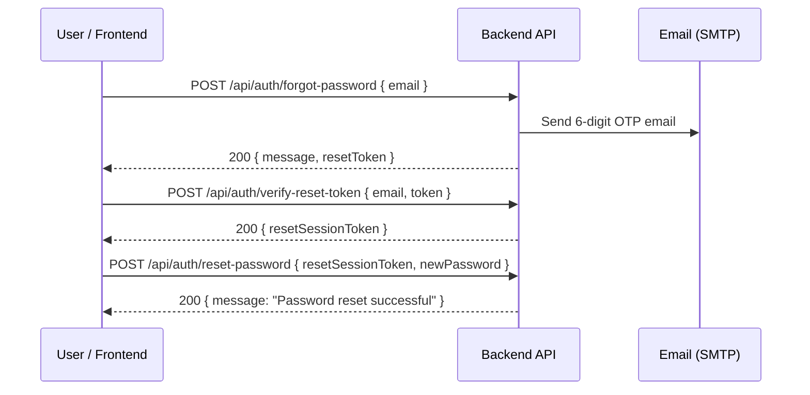
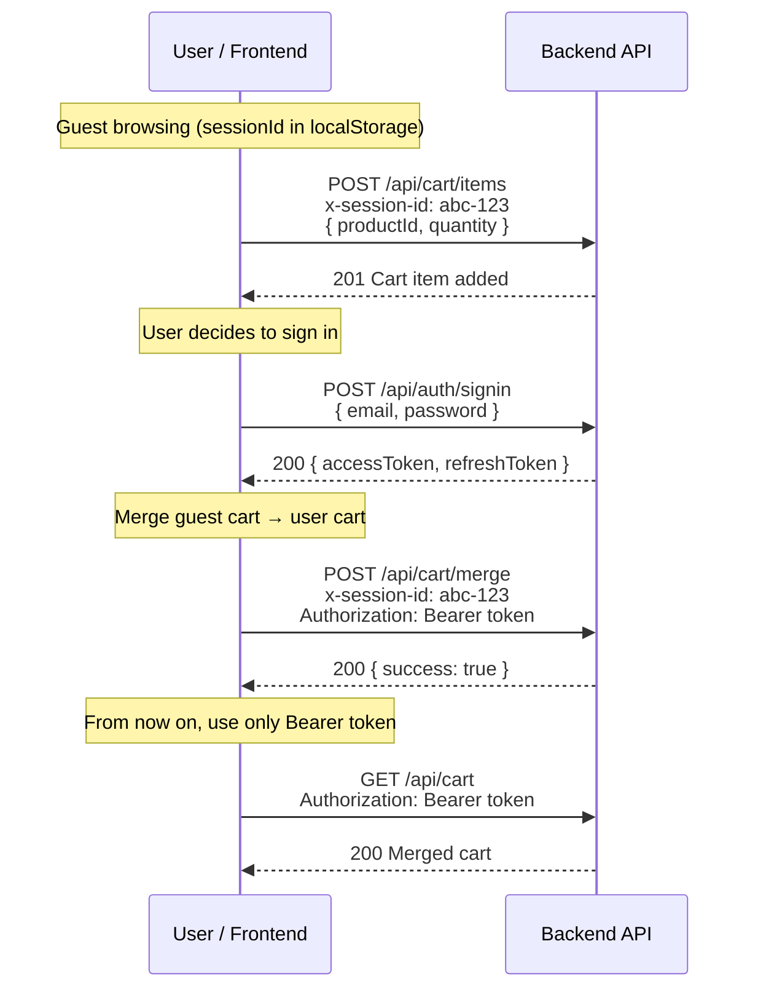
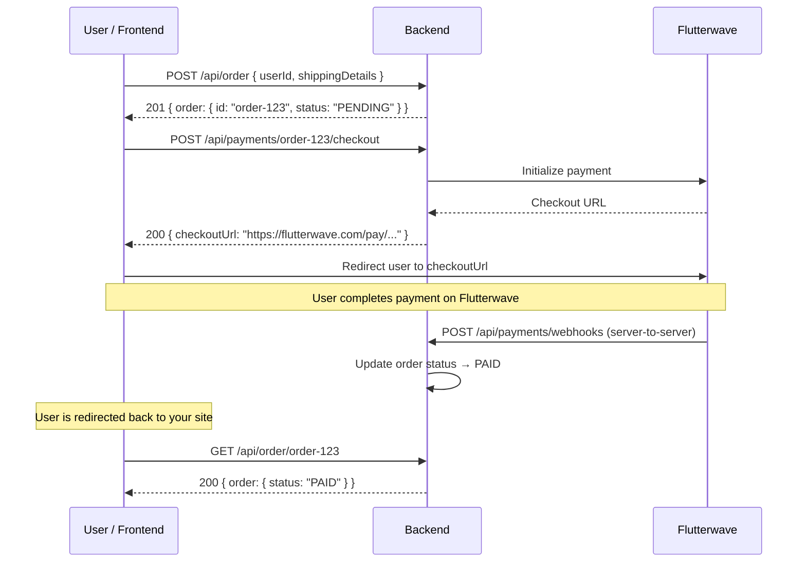

# E-Commerce Backend — Frontend Developer Guide

**Base URL:** `https://ecommerce-backend-3-7dic.onrender.com`
**Swagger Docs:** `https://ecommerce-backend-3-7dic.onrender.com/api-docs`

---

## Project Overview

This is a full-featured e-commerce REST API built with **Express 5**, **Prisma ORM**, **PostgreSQL (Neon)**, and **Flutterwave** for payments. It supports:

- User registration & login with JWT authentication
- Full password reset flow via email (6-digit OTP)
- Product CRUD with image uploads (Cloudinary)
- Shopping cart for both **guest** and **authenticated** users, with cart merging on login
- Order creation from cart, with shipping details
- Payment checkout via Flutterwave (redirect-based)
- Webhook-driven payment confirmation

---

## How Authentication Works

The API uses **JWT Bearer tokens**. After signup or signin, you receive an `accessToken` (expires in **15 minutes**) and a `refreshToken` (expires in **7 days**).

### Sending Authenticated Requests

Add this header to every protected request:

```
Authorization: Bearer <accessToken>
```

### Token Refresh Flow

When the access token expires, call the refresh endpoint to get a new one **without** forcing the user to log in again.

---

## API Reference

### 🔐 Auth — `/api/auth`

---

#### `POST /api/auth/signup`

Create a new user account.

**Body (JSON):**
```json
{
  "name": "John Doe",
  "email": "john@example.com",
  "password": "MyPass123"
}
```

> [!IMPORTANT]
> **Password rules:** Minimum 8 characters, at least 1 uppercase letter, at least 1 digit.

**✅ Response `201`:**
```json
{
  "message": "user created successfully",
  "user": {
    "id": "uuid-string",
    "email": "john@example.com",
    "name": "John Doe"
  },
  "accessToken": "eyJhbGciOi...",
  "refreshToken": "eyJhbGciOi..."
}
```

**Frontend action:** Store `accessToken` and `refreshToken` (in memory / httpOnly cookie). Redirect to home page.

---

#### `POST /api/auth/signin`

Sign in an existing user.

**Body (JSON):**
```json
{
  "email": "john@example.com",
  "password": "MyPass123"
}
```

**✅ Response `200`:**
```json
{
  "message": "Login Successful",
  "user": {
    "id": "uuid-string",
    "name": "John Doe",
    "email": "john@example.com"
  },
  "accessToken": "eyJhbGciOi...",
  "refreshToken": "eyJhbGciOi..."
}
```

**❌ Response `400`:**
```json
{ "message": "invalid credential" }
```

---

#### `POST /api/auth/refresh-token`

Get a fresh access token using the refresh token.

**Body (JSON):**
```json
{
  "refreshToken": "eyJhbGciOi..."
}
```

**✅ Response `200`:**
```json
{
  "accessToken": "eyJhbGciOi..."
}
```

**Frontend action:** Call this automatically when a request returns `401`. Replace the stored access token and retry the original request.

---

#### `POST /api/auth/forgot-password`

Request a password reset email (sends a 6-digit OTP to the user's email).

**Body (JSON):**
```json
{
  "email": "john@example.com"
}
```

**✅ Response `200`:**
```json
{
  "message": "password reset link sent to your email",
  "resetToken": "482916"
}
```

**Frontend action:** Navigate to the "Enter OTP" screen.

---

#### `POST /api/auth/verify-reset-token`

Verify the 6-digit OTP the user received via email. Returns a one-time `resetSessionToken`.

**Body (JSON):**
```json
{
  "email": "john@example.com",
  "token": "482916"
}
```

**✅ Response `200`:**
```json
{
  "message": "token verified, you can now reset your password",
  "resetSessionToken": "a1b2c3d4-uuid-string"
}
```

> [!WARNING]
> The user has a maximum of **3 attempts** to enter the correct OTP. After 3 failures, they must request a new code. The OTP expires after **15 minutes**.

**Frontend action:** Store the `resetSessionToken` temporarily, navigate to "New Password" screen.

---

#### `POST /api/auth/reset-password`

Set a new password using the session token from the previous step.

**Body (JSON):**
```json
{
  "resetSessionToken": "a1b2c3d4-uuid-string",
  "newPassword": "NewSecure1"
}
```

**✅ Response `200`:**
```json
{ "message": "Password reset successful" }
```

> [!NOTE]
> The `resetSessionToken` expires **10 minutes** after verification. The same password rules apply (8+ chars, 1 uppercase, 1 digit).

---

### Complete Password Reset Flow Diagram



---

### 📦 Products — `/api/product`

---

#### `GET /api/product`

Get all products. **No auth required.**

**✅ Response `200`:**
```json
{
  "success": true,
  "products": [
    {
      "id": "clxyz123",
      "title": "Wireless Headphones",
      "description": "Noise cancelling over-ear headphones",
      "price": 79.99,
      "stock": 25,
      "imageUrl": "https://res.cloudinary.com/...",
      "imageId": "products/abc123",
      "createdAt": "2026-07-10T12:00:00.000Z",
      "updatedAt": "2026-07-10T12:00:00.000Z"
    }
  ]
}
```

---

#### `GET /api/product/:id`

Get a single product by ID. **No auth required.**

**✅ Response `200`:**
```json
{
  "success": true,
  "product": {
    "id": "clxyz123",
    "title": "Wireless Headphones",
    "description": "...",
    "price": 79.99,
    "stock": 25,
    "imageUrl": "https://res.cloudinary.com/...",
    "imageId": "products/abc123",
    "createdAt": "...",
    "updatedAt": "..."
  }
}
```

---

#### `POST /api/product` 🔒 Admin Only

Create a new product. Requires **Bearer token** from an admin user.

**Body (`multipart/form-data`):**

| Field         | Type   | Required |
|---------------|--------|----------|
| `title`       | string | ✅       |
| `description` | string | ❌       |
| `price`       | number | ✅       |
| `stock`       | number | ✅       |
| `image`       | file   | ✅       |

**JavaScript example (FormData):**
```javascript
const form = new FormData();
form.append("title", "Wireless Headphones");
form.append("description", "Noise cancelling headphones");
form.append("price", "79.99");
form.append("stock", "25");
form.append("image", fileInput.files[0]);

const res = await fetch(`${BASE_URL}/api/product`, {
  method: "POST",
  headers: {
    Authorization: `Bearer ${accessToken}`,
    // ⚠️ Do NOT set Content-Type — the browser sets it automatically with the boundary
  },
  body: form,
});
```

**✅ Response `201`:**
```json
{
  "success": true,
  "product": { "id": "...", "title": "...", "imageUrl": "..." }
}
```

---

#### `PUT /api/product/:id` 🔒 Admin Only

Update a product. Same `multipart/form-data` format. Image is optional (only send if replacing).

---

#### `DELETE /api/product/:id` 🔒 Admin Only

Delete a product and its Cloudinary image.

**✅ Response `200`:**
```json
{
  "success": true,
  "message": "Product and its image were successfully deleted"
}
```

---

### 🛒 Cart — `/api/cart`

The cart works for **both guests and logged-in users**.

#### How Cart Identity Works

| User State      | How the API identifies the cart                       |
|-----------------|-------------------------------------------------------|
| **Guest**       | Send a custom `x-session-id` header (a UUID you generate on the frontend) |
| **Logged in**   | Send the `Authorization: Bearer <token>` header       |
| **Both**        | Send both headers — used during cart merge             |

> [!TIP]
> Generate a `sessionId` (e.g., `crypto.randomUUID()`) when the user first visits the site and store it in `localStorage`. Send it as `x-session-id` on every cart request. This allows guests to build a cart before signing up.

---

#### `GET /api/cart`

Get the current cart.

**Headers:**
```
x-session-id: <your-generated-uuid>        ← for guests
Authorization: Bearer <accessToken>         ← for logged-in users
```

**✅ Response `200`:**
```json
{
  "id": "cart-uuid",
  "userId": null,
  "items": [
    {
      "id": "item-uuid",
      "productId": "clxyz123",
      "product": {
        "id": "clxyz123",
        "title": "Wireless Headphones",
        "price": 79.99,
        "imageUrl": "https://..."
      },
      "quantity": 2,
      "price": 79.99,
      "lineTotal": 159.98
    }
  ],
  "subtotal": 159.98,
  "total": 159.98
}
```

---

#### `POST /api/cart/items`

Add an item to the cart.

**Headers:** `x-session-id` and/or `Authorization`

**Body (JSON):**
```json
{
  "productId": "clxyz123",
  "quantity": 2
}
```

**✅ Response `201`:** Returns the created cart item.

---

#### `PATCH /api/cart/items/:productId`

Update quantity of a cart item.

**Body (JSON):**
```json
{
  "quantity": 5
}
```

**✅ Response `200`:** Returns the updated cart item.

---

#### `DELETE /api/cart/items/:productId`

Remove an item from the cart.

**✅ Response `200`:**
```json
{ "success": true }
```

---

#### `POST /api/cart/merge`

Merge a guest cart into the user's cart after signing in. **Requires both headers.**

**Headers:**
```
x-session-id: <guest-session-uuid>
Authorization: Bearer <accessToken>
```

**✅ Response `200`:**
```json
{ "success": true }
```

> [!IMPORTANT]
> Call this **immediately after signin** if the user had items in a guest cart. This transfers guest cart items into the user's permanent cart.

---

### Cart + Auth Flow Diagram



---

### 📋 Orders — `/api/order`

All order endpoints require **authentication** (`Authorization: Bearer <token>`).

---

#### `POST /api/order` 🔒

Create an order from the user's cart.

**Body (JSON):**
```json
{
  "userId": "user-uuid",
  "shippingDetails": {
    "shippingName": "John Doe",
    "shippingAddress": "123 Main St",
    "shippingCity": "Lagos",
    "shippingCountry": "Nigeria"
  },
  "paymentMethod": "FLUTTERWAVE"
}
```

**✅ Response `201`:**
```json
{
  "success": true,
  "order": {
    "id": "order-uuid",
    "userId": "user-uuid",
    "status": "PENDING",
    "subtotal": "159.98",
    "tax": "0",
    "shippingFee": "0",
    "discount": "0",
    "total": "159.98",
    "shippingName": "John Doe",
    "shippingAddress": "123 Main St",
    "shippingCity": "Lagos",
    "shippingCountry": "Nigeria",
    "items": [
      {
        "id": "item-uuid",
        "productId": "clxyz123",
        "quantity": 2,
        "price": "79.99"
      }
    ],
    "createdAt": "...",
    "updatedAt": "..."
  }
}
```

---

#### `GET /api/order/user/:userId` 🔒

Get all orders for a specific user.

**✅ Response `200`:**
```json
{
  "success": true,
  "orders": [ { ... }, { ... } ]
}
```

---

#### `GET /api/order/:id` 🔒

Get a single order by its ID.

**✅ Response `200`:**
```json
{
  "success": true,
  "order": { ... }
}
```

---

#### `PATCH /api/order/:id/status` 🔒

Update order status.

**Body (JSON):**
```json
{
  "status": "SHIPPED",
  "trackingNumber": "TRK-12345"
}
```

**Valid statuses:** `PENDING` | `PAID` | `PROCESSING` | `SHIPPED` | `DELIVERED` | `CANCELLED` | `REFUNDED`

---

#### `DELETE /api/order/:id` 🔒

Soft-delete an order (marks it as hidden, doesn't permanently remove it).

**✅ Response `200`:**
```json
{
  "success": true,
  "message": "Order was successfully deleted (hidden)"
}
```

---

### 💳 Payments — `/api/payments`

---

#### `POST /api/payments/:orderId/checkout`

Initiate a Flutterwave payment for an order. Returns a URL to redirect the user to.

**✅ Response `200`:**
```json
{
  "success": true,
  "checkoutUrl": "https://checkout.flutterwave.com/v3/hosted/pay/..."
}
```

**Frontend action:**
```javascript
const res = await fetch(`${BASE_URL}/api/payments/${orderId}/checkout`, {
  method: "POST",
});
const data = await res.json();

// Redirect user to the Flutterwave payment page
window.location.href = data.checkoutUrl;
```

> [!NOTE]
> After payment, Flutterwave sends a webhook to `POST /api/payments/webhooks` which automatically updates the order status to `PAID`. You do **not** need to call this webhook yourself — it's server-to-server.

---

### Complete Checkout Flow Diagram



---

## Quick Setup Checklist for Frontend

```javascript
// 1. Set the base URL
const BASE_URL = "https://ecommerce-backend-3-7dic.onrender.com";

// 2. Generate a session ID for guest carts (store in localStorage)
const getSessionId = () => {
  let sid = localStorage.getItem("sessionId");
  if (!sid) {
    sid = crypto.randomUUID();
    localStorage.setItem("sessionId", sid);
  }
  return sid;
};

// 3. Create a reusable fetch wrapper
const api = async (path, options = {}) => {
  const token = localStorage.getItem("accessToken");
  const sessionId = getSessionId();

  const headers = {
    "Content-Type": "application/json",
    "x-session-id": sessionId,
    ...options.headers,
  };

  if (token) {
    headers["Authorization"] = `Bearer ${token}`;
  }

  const res = await fetch(`${BASE_URL}${path}`, {
    ...options,
    headers,
  });

  // Auto-refresh on 401
  if (res.status === 401 && path !== "/api/auth/refresh-token") {
    const refreshToken = localStorage.getItem("refreshToken");
    if (refreshToken) {
      const refreshRes = await fetch(`${BASE_URL}/api/auth/refresh-token`, {
        method: "POST",
        headers: { "Content-Type": "application/json" },
        body: JSON.stringify({ refreshToken }),
      });

      if (refreshRes.ok) {
        const { accessToken } = await refreshRes.json();
        localStorage.setItem("accessToken", accessToken);
        headers["Authorization"] = `Bearer ${accessToken}`;
        // Retry original request
        return fetch(`${BASE_URL}${path}`, { ...options, headers });
      }
    }
  }

  return res;
};
```

### Usage Examples

```javascript
// Sign up
const signup = await api("/api/auth/signup", {
  method: "POST",
  body: JSON.stringify({ name: "John", email: "john@example.com", password: "MyPass123" }),
});

// Get products (public)
const products = await api("/api/product");

// Add to cart (works for guests too)
const cartItem = await api("/api/cart/items", {
  method: "POST",
  body: JSON.stringify({ productId: "clxyz123", quantity: 1 }),
});

// Create order (auth required)
const order = await api("/api/order", {
  method: "POST",
  body: JSON.stringify({
    userId: "user-uuid",
    shippingDetails: {
      shippingName: "John Doe",
      shippingAddress: "123 Main St",
      shippingCity: "Lagos",
      shippingCountry: "Nigeria",
    },
    paymentMethod: "FLUTTERWAVE",
  }),
});
```

---

## Error Handling

All error responses follow this shape:

```json
{ "message": "Descriptive error message" }
```

| Status | Meaning                                   |
|--------|-------------------------------------------|
| `400`  | Validation error or bad request body      |
| `401`  | Missing, invalid, or expired access token |
| `403`  | Unauthorized access (e.g., not admin)     |
| `404`  | Resource not found                        |
| `500`  | Server error                              |

---

> [!TIP]
> Swagger interactive docs are available at [`/api-docs`](https://ecommerce-backend-3-7dic.onrender.com/api-docs) — you can test every endpoint directly from the browser.
